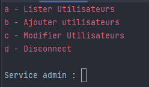

```
@credit : https://github.com/nouha404
```

# MENU DE L'APPLICATION


### 1- Creer un admin 
````python
f"""
On lance la fonction { admin_login() } et on 
dé-commente la ligne 139 afin d'inserer les element dans la db

 ligne 139 : {Admin.insert({'login': login_combination, 'password': password})}"""

````

### 2- Les US de l'admin


### 2-b US Ajout utilisateur


### Partie CLIENT


### Partie SECRETAIRE


### b- MODIFIER RV SECRETAIRE


### Partie MEDECIN


## LES BIBLIOTHEQUE QUE J'AI UTILISER
```python
"""
import json
import os
import time
from datetime import datetime
from random import sample

import typer
from rich import print
from rich.console import Console
from rich.progress import track
from rich.table import Table
from tinydb import TinyDB, where
"""
```

### A - TYPER
```
J'ai utiliser typer pour rendre l'interface et un peu plus colorer et aussi 
pouvoir utiliser le systeme de table pour representer mes données dans la DB 
de maniere plus esthetique

a- La fonction track permet de faire un progress bar
    for _ in track(range(100), description="Chargement de tous les utilisateurs..."):

b- La partie Table :
1- On import la class Table -> from rich.table import Table'
2- on creer une instance de la classe -> table = Table()
3- On creer les colonnes ->  table = Table('NOM', 'PRENOM')
4- on boucle sur les elements puis on utiliser table.add_row() pour inserer les ligne 
Exemple:
    for item in Client:
        table.add_row(item.get('nom', 'pas assigné'),
                      item.get('prenom', 'pas assigné'),
                      item.get('email', 'pas assigné'),
                      )
    console.print(table)
A la fin on ajoute console.print() pour afficher la table 
NB : console est dabord importer afin de creer son instance -> from rich.console import Console
-> console = Console()

``` 
### B - TinyDB
```
C'est une bibiotheque qui permet de gerer les bases de données de maniere plus
simple

1- On l'importe from tinydb import TinyDB

2 - on creer une instance -> db = TinyDB('fichier.json',indent=4)

3 - insersion de base db.insert({"name": "Python", "score": 20})

3 -a Insersion mutiple db.insert_multiple([
    {"name": "Java", "score": 30},
    {"name": "C", "score": 0}
])

4 - chercher des infos a l'interieur de la db -> from tinydb import TinyDB, where
-> score_level = db.search(where("score") > 10 )

5 - Mettre a jour un element
-> db.update({"score":100, 'role': ["Senior"]}, where('name') == 'C')

5-a Mettre a jour une donnée si elle elle existe , sinon il va l'inserer
-> db.upsert({'name': "Kakou", "score": 20, 'hobbi': 'Manga'}, where("name") == "Samba")

6 - Supprimer un element dans la db
db.remove(where("score") == 0)
6-a supprimer tous les elemnts
-> db.truncate()

7 - a creer une table
CLIENT = db.table('CLIENT')
-> Client.update({'service': new_service}, where('service') == item['service'])


```